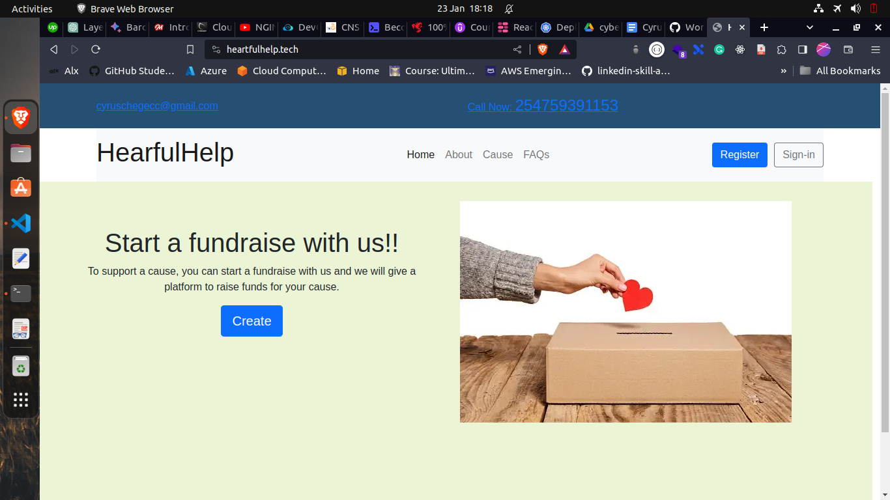

# HeartfulHelp
A Fundraising Hosting Platform, where users can create fundraisers cause and people can donate to the cause.

This was my final portfolio project for ALX Software Engineering program.

## Features

- User can create an account
- User can login
- Logged in user can create a fundraiser
- Logged in user can view their fundraiser causes
- users can donate to a fundraiser using Mpesa payment gateway
- users can view all fundraisers causes

## Technologies
- Python (Django)
- HTML
- CSS
- Bootstrap
- Javascript
- Mpesa API
- AWS for hosting
- Nginx as reverse proxy
- Gunicorn as WSGI server
- Github Actions for CI/CD
- Certbot for SSL


## Demo

[HeartfulHelp](https://heartfulhelp.tech/)


### Home Page



## Installation
You can run the application locally by following the steps below:

1. Clone the repository

```
git clone https://github.com/CyrusNchege/HeartfulHelp.git


cd HeartfulHelp

```
2. Create a virtual environment

```
python -m venv venv

```
3. Activate the virtual environment

```
source venv/bin/activate # for linux
```
```
venv\Scripts\activate # for windows

```


4. Install dependencies

```
pip install -r requirements.txt
```

5. Setup .env file

```
cp .env.example .env
```
This will create a .env file and copy the contents of .env.example to it.

6. Generate a secret key

```
python -c 'from django.core.management.utils import get_random_secret_key; print(get_random_secret_key())'
```

Copy the generated key and paste it as the value of SECRET_KEY in the .env file.


7. Run migrations

```
python manage.py migrate
```

8. Run the application

```
python manage.py runserver
```

## Additional setup
The app uses Mpesa API for payment. To use this feature, you need to create an account on [Safaricom Developer Portal](https://developer.safaricom.co.ke/) and create an app. You will get a consumer key and consumer secret which you will use to generate an access token. 

Replace the values of CONSUMER_KEY and CONSUMER_SECRET in the .env file with the values you got from the developer portal.

Also this app uses Google Outh2 for authentication. To use this feature, you need to create a project on [Google Cloud Platform](https://console.cloud.google.com/) and enable Google Oauth2 API. You will get a client id and client secret which you will use to generate an access token.


## Contributing
Pull requests are welcome. For major changes, please open an issue first to discuss what you would like to change.


Thanks and happy coding :)
